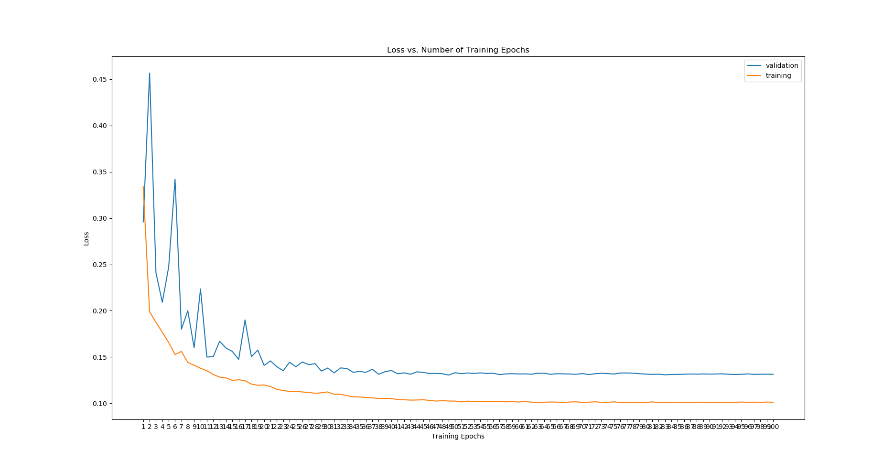
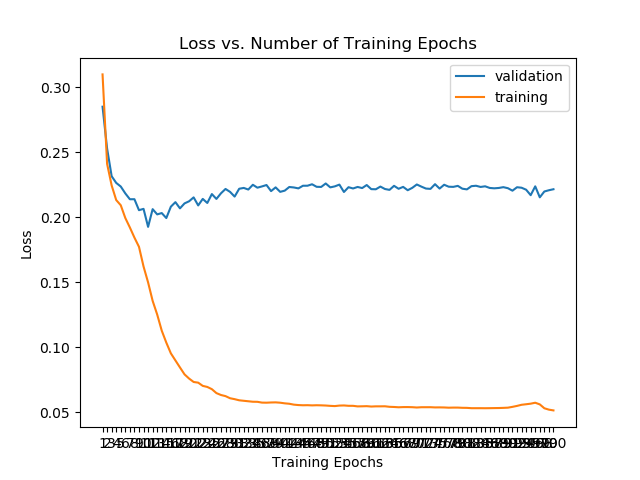
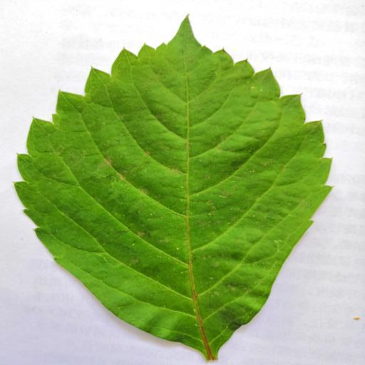
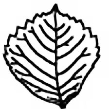
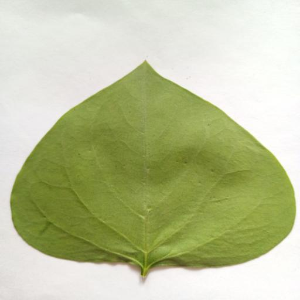
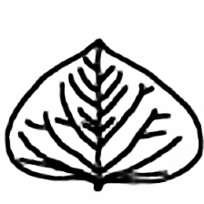

# Leaf Classification and Vein Segmentation

*Class Assignment in junior year* : see [Requirement](img/requirement.pdf)  

## Leaf Classification

For all, three kinds of leaves are provided, and each one is organized in a certain directory, like this (I set them into different parts):  

> data_dir/train/Leaf_0/xxx.png  
> data_dir/train/Leaf_1/xy.png  
> data_dir/train/Leaf_2/xxz.png  
> data_dir/val/Leaf_0/lxx.png  
> data_dir/val/Leaf_1/gy.png  
> data_dir/val/Leaf_2/llz.png  

It's easy to finish this classical task using pretrained model on ImageNet or something else. So I directly use feature extraction of Resnet-50 and train the last dense layer, under guide of [tutorial](https://pytorch.org/tutorials/beginner/finetuning_torchvision_models_tutorial.html) on pytorch official website.  

### File Included  

+ main_task1.py -> main function including training and loading  
+ predict_task1.py -> prediction function taking one image a time \[I think you can transform it into multi-input one easily\]. And I add in softmax on the final output, so the output value can be responsible for the posibility.  

## Leaf Vein Segmentation

For all, three kinds of leaves and their scratch vein images are provided and some data maybe totally wrong, so please do data filting first. Data structure is like this (I set them into different parts) and notice the mask has same name with the input image, so you can use it to load the label:  

> data_dir/train/input/xxx.png  
> data_dir/train/mask/xxx.png  
> data_dir/val/input/yy.png  
> data_dir/val/mask/yy.png

I think it's more like a segmentation task, so use a image-to-image network, with top-down&bottom-up (U-Net) or other encoder-decoder structure (FCN).  
As for U-Net, I both try standard U-Net structure and [adapted U-Net structure](https://github.com/milesial/Pytorch-UNet/). I find that the adapted one has better result... Although I can't figure out why.  
As for FCN, actually I just modify the last two layer of Resnet-50 and add in some layers of transpose convolution to upsample the feature maps until the target resolution. You can use the pretrained resnet model or not, for I both earn enough good result.  

### File Included

+ main_task2.py -> main function including training and loading. You can set some important hyperparameters just at the beginning of the file.  
+ dataset_task2.py -> rewrite the dataset object of pytorch, so you can load the input image and mask label according to their name in the same time.  
+ predict_task2.py -> prediction function taking one image a time \[I think you can transform it into multi-input one easily\].  
+ U_Net.py -> standard U-Net Structure Model.  
+ UNet_Adapted.py -> adapted U-Net Structure Model.  
+ FCN -> resnet-based naive model.  

### Training And Evaluation  

+ Adapted-Unet  

<div align="center">

</div>

+ Naive FCN  

<div align="center">

</div>

+ Evaluation  

<p align = "center">


</p>

<p align = "center">


</p>

[Comment]:

    <div align="center">  
    <table><tr>  

    <td></td>
    <td></td>
    </tr></table>

    <table><tr>
    <td></td>
    <td></td>
    </tr></table>
    </div>

## Data and Pretrained Model

Data & Pretrained Model: If you really need it, feel free to connect to me...  

## Requirement

+ pytorch
+ torchvision
+ numpy
+ matplotlib
+ tqdm
+ pillow

See: [config requirement](./img/config.yaml)  

## Citing

If you really need this repo, please follow this BibTex:  
```
@misc{LeafVein, 
    author = {Yixuan, Wei},
    title = {Leaf Classification and Vein Segmentation},
    howpublished = {\url{https://github.com/weiyx16/Leaf-Classification-Segmentation}},
    year = {2019}
}
```
